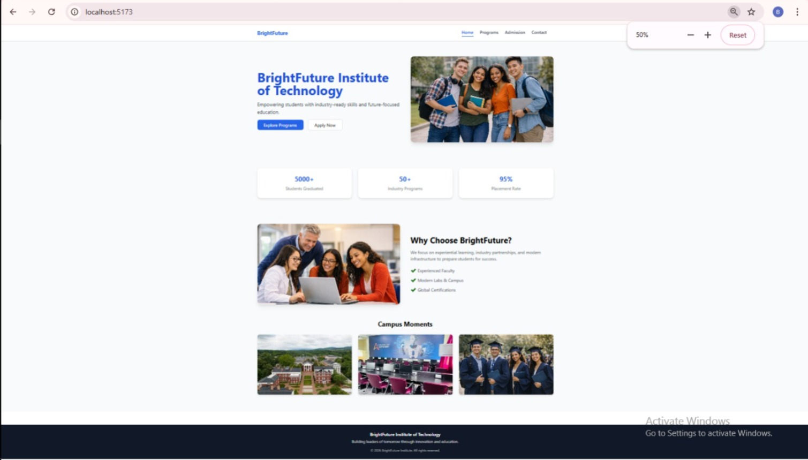
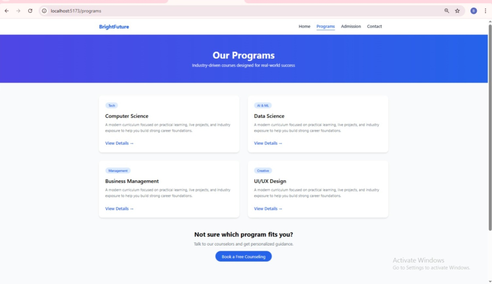
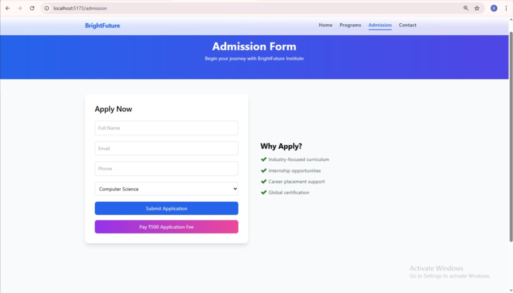
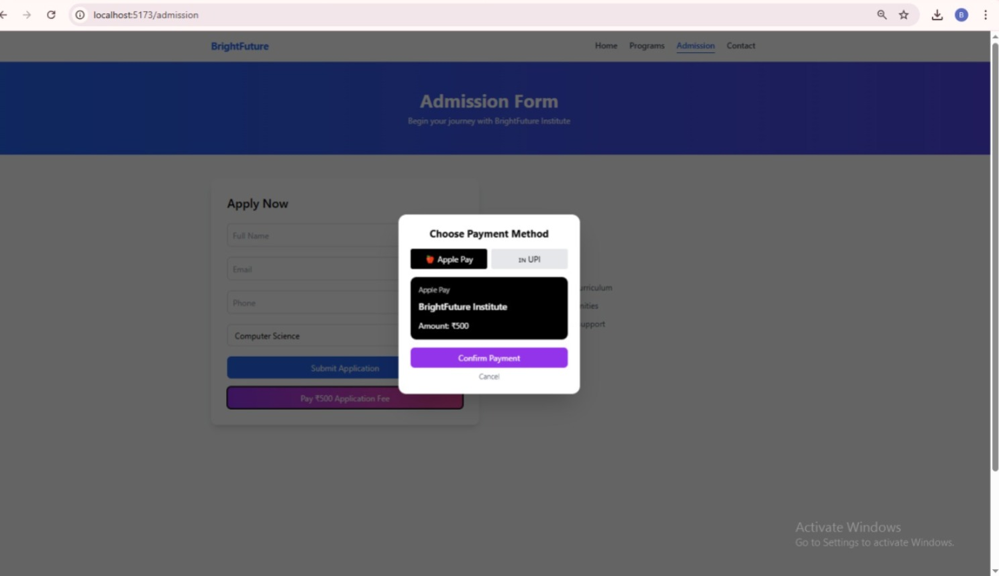
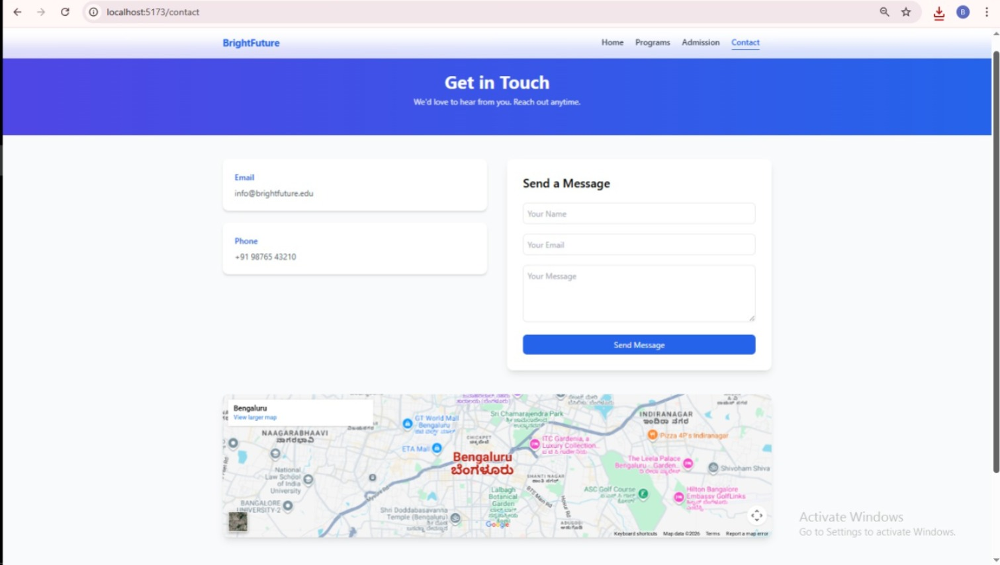

# 🎓 BrightFuture Institute Website

A modern, responsive, and SEO-friendly educational institute website built using React and Tailwind CSS.

> Designed to simulate a real-world institute website with admission workflow and payment integration.

---

## 🚀 Live Demo

🔗 https://teal-vacherin-404d9a.netlify.app/

---

## 📸 Project Screenshots

### 🏠 Home Page


### 📚 Programs Page


### 📝 Admission Form


### 💳 Payment Integration (Demo Mode)


### 📞 Contact Page


---

## ✨ Features

- ✅ Multi-page layout (Home, Programs, Admission, Contact)
- ✅ Fully Responsive Design (Mobile + Tablet + Desktop)
- ✅ SEO Optimized Structure
- ✅ Admission Form with EmailJS Integration
- ✅ Demo Payment using Razorpay Test Mode
- ✅ Clean and Modern UI using Tailwind CSS
- ✅ Form Validation
- ✅ Realistic Institute Branding

---

## 🛠️ Tech Stack

- ⚛️ React
- 🎨 Tailwind CSS
- 📧 EmailJS
- 💳 Razorpay (Test Mode)
- 🌍 Netlify (Deployment)

---

## 📁 Project Structure

```bash
brightfuture-institute
├── public
├── src
│   ├── components
│   ├── pages
│   ├── assets
│   └── App.jsx
├── package.json
├── tailwind.config.js
└── README.md


## ⚙️ Installation & Setup

1️⃣ Clone the repository

git clone https://github.com/Bhavana1129/brightfuture-institute.git
